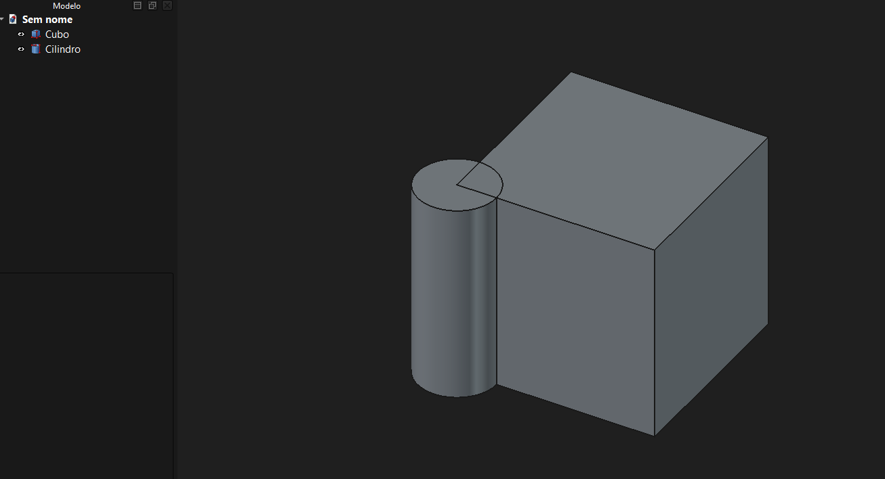
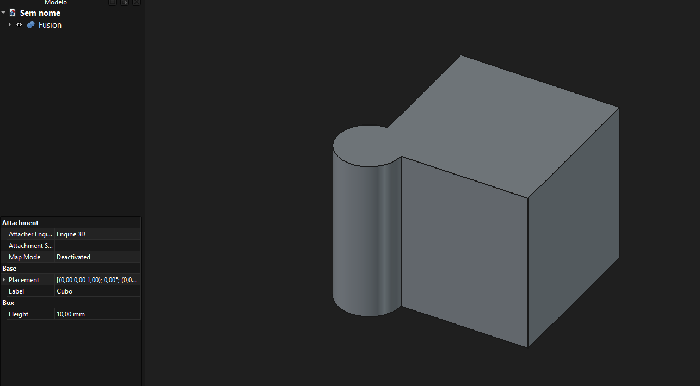
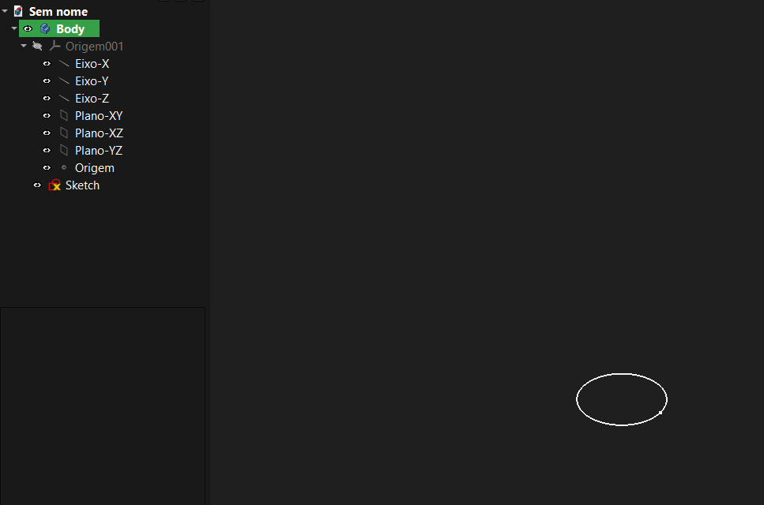
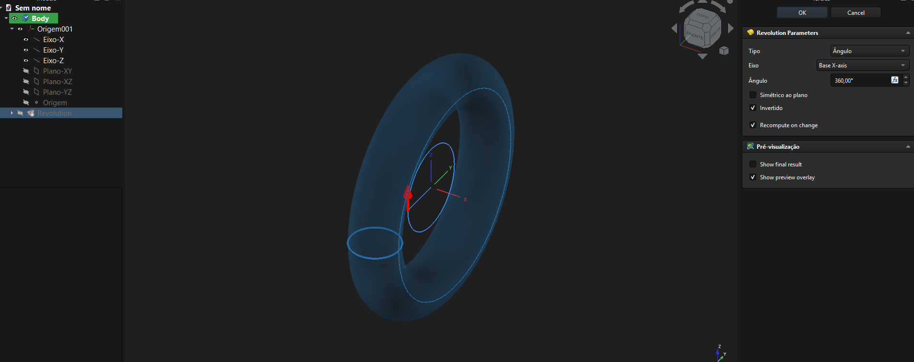
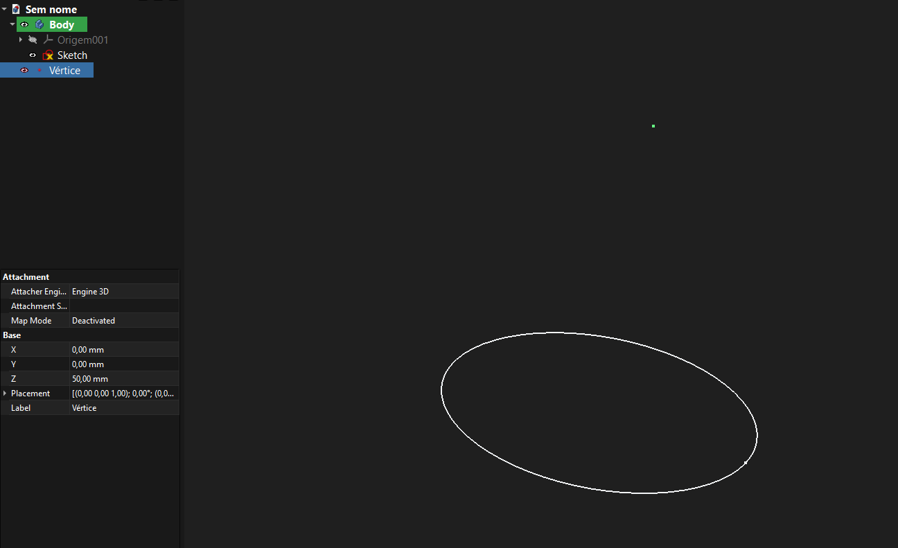
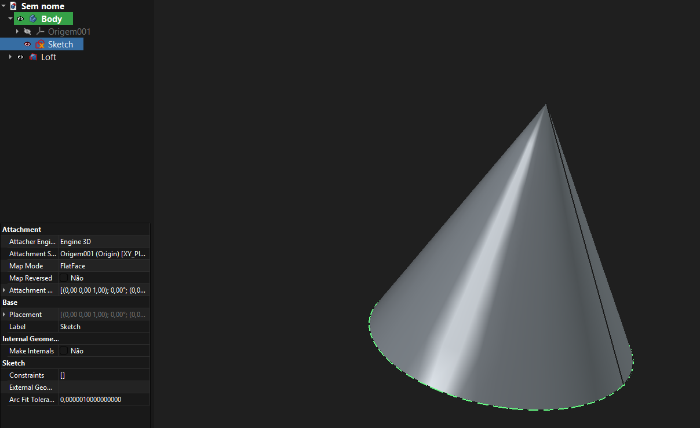
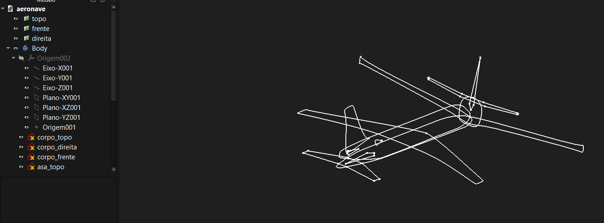
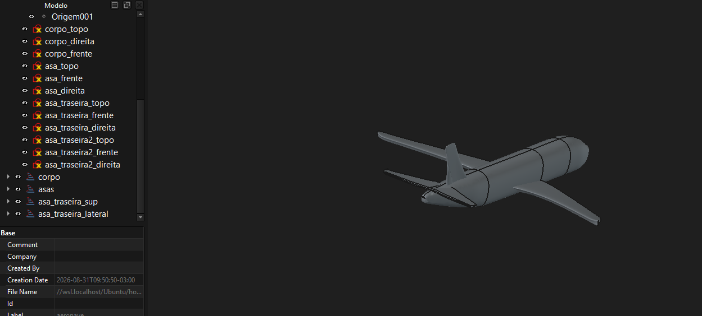

# Modelos de Representação Geométrica no FreeCAD
### Modelagem Geométrica

---

## FreeCAD: um software, vários modelos

- Software livre e **paramétrico** de modelagem 3D (engenharia mecânica, design, BIM, simulação, CAM)
- Arquitetura em **workbenches**: cada bancada é especializada numa tarefa e, por consequência, numa **representação geométrica**
- Nenhuma representação serve para tudo: precisão exata (B-rep) ≠ visualização rápida (malha) ≠ simulação (FEM) ≠ fabricação (toolpath)

<div class="alerta">
Ideia central: o FreeCAD mantém um <b>modelo mestre</b> (B-rep) e <b>deriva</b> dele as demais representações, conforme a etapa do fluxo de trabalho.
</div>

---

## OCCT: o coração geométrico

**Open CASCADE Technology** — biblioteca C++ usada como *kernel* do FreeCAD.

- Estruturas de dados de **B-rep**: `TopoDS_Shape`, faces, arestas, vértices
- Algoritmos: booleanos, fillets, chamfers, sweep, extrusão, revolução
- **Tesselação** (`BRepMesh`) que gera a malha de visualização

<div class="alerta">
Quase toda representação do FreeCAD se relaciona com o OCCT: é <b>gerada</b> por ele (B-rep, malha), <b>convertida</b> a partir dele (FEM, TechDraw, Path) ou o <b>alimenta</b> como entrada (Sketcher).
</div>

---

## B-rep (Boundary Representation)

**Workbenches:** Part, Part Design, Surface

- Topologia hierárquica: **Compound → Solid → Shell → Face → Wire → Edge → Vertex**
- Cada `Face` referencia uma **superfície matemática** (plano, cilindro, NURBS), delimitada por `Wires`
- Cada `Edge` referencia uma **curva** (reta, círculo, spline) — não pontos discretos
- Booleanos recalculam a topologia **exatamente**, recortando curvas e superfícies analiticamente (sem perda de precisão, ao contrário de um boolean em malha)
- Cada feature (Pad, Pocket, Fillet) gera um novo `TopoDS_Shape`, formando a **árvore paramétrica**

---

## Booleanos sobre B-rep — os sólidos de partida



Dois primitivos exatos: cubo e cilindro.

---

## União

<div class="cols">



</div>

Cubo ∪ Cilindro &nbsp;&nbsp;

---

## Interseção

<div class="cols">


</div>

&nbsp;&nbsp; Cubo ∩ Cilindro

---

## Diferença

<div class="cols">


</div>

Cubo − Cilindro &nbsp;&nbsp;

---

## Diferença

<div class="cols">


</div>

&nbsp;&nbsp; Cilindro − Cubo

---

## Geração de sólidos: revolução

<div class="cols">



---

## Geração de sólidos: revolução

<div class="cols">



</div>

Um perfil 2D exato varrido em torno de um eixo gera um sólido B-rep — as superfícies resultantes continuam **analíticas**.

---

## Geração de sólidos: loft

<div class="cols">



---

## Geração de sólidos: loft

<div class="cols">



</div>

Círculo + ponto → cone. O loft interpola superfícies entre seções, gerando faces NURBS.

---

## Geometria com restrições (Sketcher)

**Motor:** planeGCS — não é B-rep nem malha, é um **sistema de equações**

- Cada elemento (linha, arco, círculo) é uma **variável simbólica**; cada restrição (coincidência, paralelismo, tangência, cota) vira uma **equação**
- O solver resolve o sistema não linear: por isso mudar uma cota "arrasta" o desenho todo
- O resultado é convertido em **curvas e arestas OCCT** quando o esboço vira geometria 3D



---

## Do esboço ao sólido



O esboço restrito alimenta operações B-rep (extrusão, loft, revolução) — e permanece **editável**: alterar uma cota reconstrói o sólido.

---

## Tesselação: a ponte entre B-rep e malha

A exibição na tela converte superfícies exatas em triângulos. O modelo original **não é alterado**.

```text
B-Rep (superfícies exatas)
        ↓
BRepMesh_IncrementalMesh
        ↓
   Triangulação
        ↓
  Malha poligonal
        ↓
Renderização / STL
```

---

## Malha poligonal (Mesh)

**Workbench:** Mesh

- Lista de **vértices** + lista de **facetas** (triângulos), sem histórico paramétrico
- Usada para STL/OBJ, scanners 3D e prototipagem rápida
- Conversão Mesh → B-rep é possível (*shape from mesh*), mas **aproximada**

<div class="alerta">
Ressalva: o FreeCAD é um CAD paramétrico, não um escultor de malhas — não substitui Blender ou Maya na modelagem direta de meshes.
</div>

---

## Nuvem de pontos (Point Cloud)

**Workbench:** Points

- Representação **mais primitiva**: apenas coordenadas (x, y, z), às vezes com cor/normal, **sem conectividade**
- Sem relação direta com o OCCT enquanto permanece nuvem; a ligação vem depois, na reconstrução
- Papel de **matéria-prima**:

```text
scanner / LiDAR → nuvem de pontos → reconstrução → malha ou B-rep
```

---

## Malha para Elementos Finitos (FEM)

**Ferramentas:** Gmsh / Netgen · **Solvers:** CalculiX, Elmer

- `Fem::FemMesh` (herda de `App::PropertyComplexGeoData`) separa a geometria em `FemNode` (IDs e coordenadas) e `FemElement` (conectividades e tipo)
- O B-rep é exportado via STEP/BREP; o malhamento é governado por `CharacteristicLengthMin/Max` e refinamentos locais
- Elementos: **1D** `SEGM2/3` · **2D** `TRIA3/6`, `QUAD4/8` · **3D** `TET4/10`, `HEX8/20`
- Pipeline: condições de contorno ancoradas em faces/arestas B-rep → *node sets* no `.inp` → resolução de $[K]\{u\} = \{F\}$ → renderização via VTK

---

## Trajetórias de ferramenta (Toolpaths)

**Workbench:** Path (CAM)

- Analisa **faces e arestas B-rep** (face de topo, contorno de um bolso) para calcular o percurso da fresa
- Gera uma sequência ordenada de `Path.Command` (retas e arcos com avanço, rotação, profundidade)
- Um **pós-processador** traduz a sequência para **G-code**
- Offsets, interseção de contornos e detecção de colisão usam os mesmos algoritmos OCCT

---

## Projeções vetoriais 2D (TechDraw)

- Aplica ao `TopoDS_Shape` uma **projeção geométrica** (ortográfica, isométrica, em corte) via `HLRBRep` (*Hidden Line Removal*)
- Produz **arestas e curvas 2D exatas** — não pixels nem malha — prontas para cotas, anotações e hachuras
- Por derivar do B-rep, alterações paramétricas no 3D **atualizam automaticamente** as vistas técnicas

---

## Resumo — modelo mestre e derivações

| Representação | Onde é usada | Papel | Relação com OCCT |
|---|---|---|---|
| B-rep | Part, Part Design, Surface | Modelo mestre (exato) | É o próprio kernel |
| Malha | Mesh, visualização, STL | Aproximação poligonal | Tesselação do B-rep |
| Nuvem de pontos | Points | Dado bruto de captura | Sem relação direta (entrada) |
| Restrições 2D | Sketcher | Base paramétrica 2D | Convertida em curvas/arestas |
---

## Resumo — modelo mestre e derivações

| Representação | Onde é usada | Papel | Relação com OCCT |
|---|---|---|---|
| Malha FEM | FEM | Simulação numérica | Discretiza via Gmsh/Netgen |
| Toolpath | Path (CAM) | Fabricação CNC | Calculada sobre faces/arestas |
| Projeção 2D | TechDraw | Documentação técnica | Projeção HLR do B-rep |

---

## Conclusão

- O **B-rep (via OCCT) é o núcleo**: preciso, exato, paramétrico
- As demais representações são **derivadas** conforme a finalidade:
  visualizar → malha · simular → malha FEM · fabricar → toolpath · documentar → projeção 2D · capturar → nuvem de pontos
- Essa arquitetura em camadas é o que permite ao FreeCAD ser, ao mesmo tempo, **preciso** (OCCT) e **versátil** (representações derivadas)