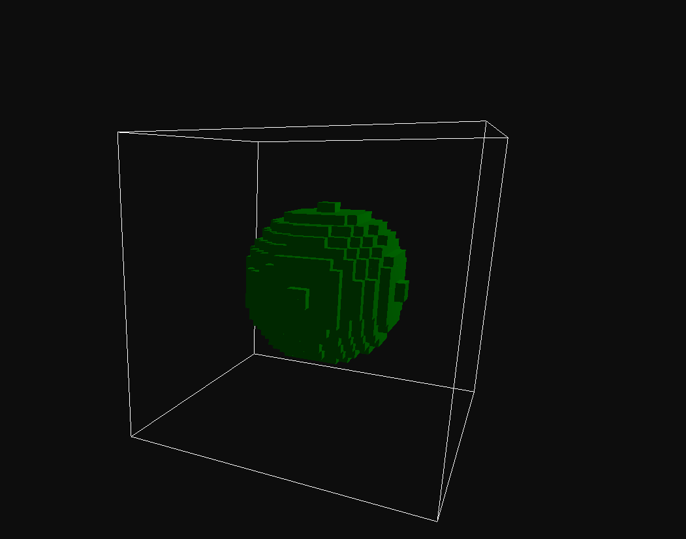
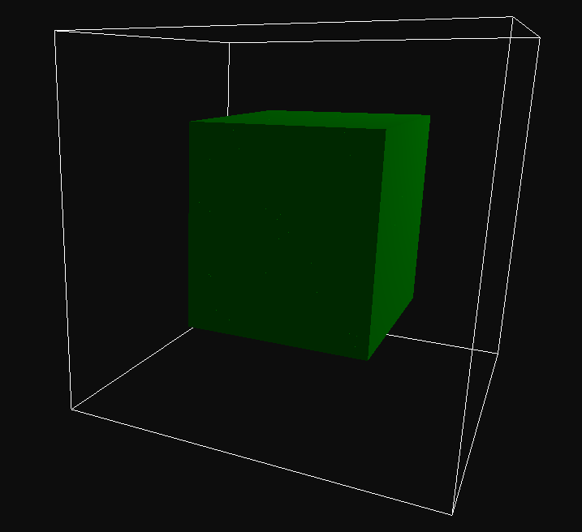
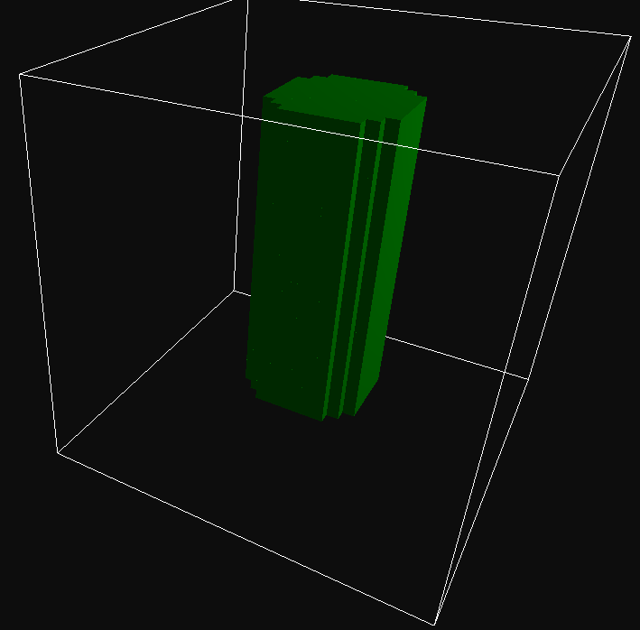
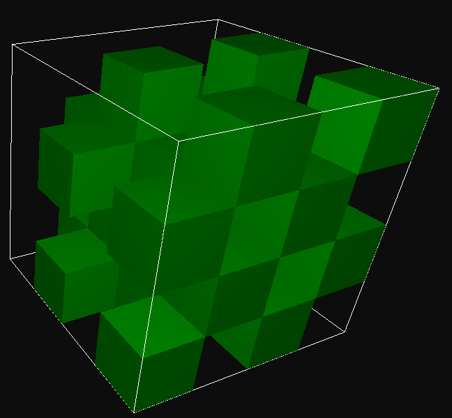
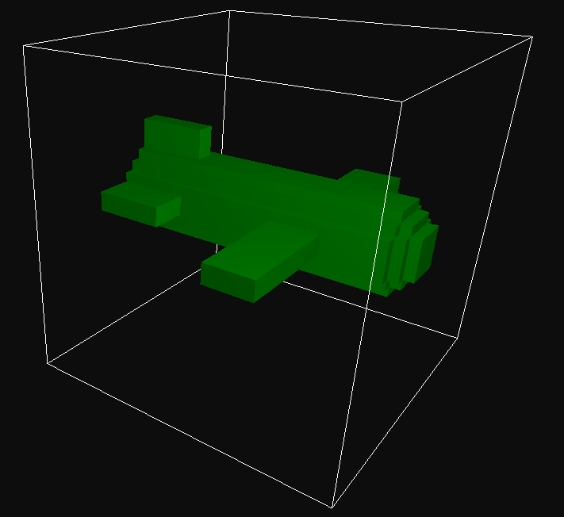

# Modelador Geométrico com Octrees

## Trabalho 01 — Modelagem Geométrica

Como converter uma **primitiva** (esfera, bloco, cilindro) em sua **octree**.

**Tecnologias:** C++ · GLFW · OpenGL · ImGui

---

# A octree

O espaço é dividido em **8 octantes**, recursivamente.

| Estado | Significado | Filhos |
|---|---|---|
| **Empty** | caixa totalmente fora do sólido | nenhum |
| **Filled** | caixa totalmente dentro do sólido | nenhum |
| **Partial** | caixa cortada pela fronteira | 8 |

A árvore sempre cobre o cubo $[-1,1]^3$. O **AABB do objeto** mapeia esse cubo para o mundo:

$$p_{mundo} = p_{min} + \frac{p + 1}{2}\,(p_{max} - p_{min})$$

---

# O algoritmo de construção

Para cada nó, uma função **classifica a caixa** do nó: `Empty`, `Partial` ou `Filled`.

```cpp
Coverage c = classifier(box);

if (c == Coverage::Partial && depth >= maxDepth)
    c = Coverage::Filled;

if (c != Coverage::Partial) { node.setLeaf(c == Filled); return; }

node.split();
// repete para os 8 octantes, com depth + 1
```

- Só a **fronteira** (nós `Partial`) é subdividida
- Na profundidade máxima, um `Partial` vira `Filled`
- A árvore não conhece a forma: tudo depende do `classifier`

---

# Como classificar uma caixa

O `classifier` recebe a caixa do nó e responde: **dentro, fora ou na fronteira?**

Quatro passos:

1. **Projetar** a caixa do nó para o mundo (AABB do objeto)
2. **Levar** a caixa ao espaço local da primitiva (posição e rotação)
3. Achar dois **pontos extremos** da caixa local
4. **Testar** esses dois pontos contra a primitiva

> Em vez de rotacionar a primitiva, a caixa é que entra no sistema de coordenadas dela.

---

# Passos 1 e 2: projeção da caixa

**Unitário → mundo:** os dois cantos da caixa passam pela fórmula do AABB do objeto.

**Mundo → local:** os **8 cantos** são transformados por

$$p_{local} = R^{-1}\,(p_{mundo} - t)$$

onde $t$ é a posição e $R$ a rotação do objeto. O **AABB desses 8 pontos** é a caixa local.

```cpp
for (int i = 0; i < 8; ++i)
{
    corner = { (i & 1) ? hi[0] : lo[0], (i & 2) ? hi[1] : lo[1], (i & 4) ? hi[2] : lo[2] };
    local  = worldToLocal(corner);
    // atualiza localMin / localMax por eixo
}
```

---

# Exemplo: caixa rotacionada

Objeto na origem, rotação de $45^\circ$ em torno de $Y$. Caixa do nó no mundo: $[0,2]^3$.

No plano $XZ$ (convenção de sinal ilustrativa), $x' = (x+z)/\sqrt{2}$ e $z' = (z-x)/\sqrt{2}$:

| Canto $(x,z)$ | Local $(x',z')$ |
|---|---|
| $(0,0)$ | $(0,\ 0)$ |
| $(2,0)$ | $(\sqrt{2},\ -\sqrt{2})$ |
| $(0,2)$ | $(\sqrt{2},\ \sqrt{2})$ |
| $(2,2)$ | $(2\sqrt{2},\ 0)$ |

AABB local: $x' \in [0, 2\sqrt{2}]$ e $z' \in [-\sqrt{2}, \sqrt{2}]$, com **área 8** contra **4** da caixa real.

---

# O que a rotação custa

<div class="alerta">

**Classificação conservadora:** o AABB local contém a caixa real, mas pode ser maior (no exemplo, o dobro da área em planta).

</div>

- **Filled** e **Empty** continuam corretos: se a caixa maior está dentro (ou fora), a caixa real também está
- Mais nós ficam `Partial` e são subdivididos
- Na profundidade máxima, esses `Partial` extras viram `Filled`, e a borda fica um pouco mais "gorda"
- Sem rotação, o AABB local é **exato**

---

# Passo 3: os dois pontos extremos

Com a primitiva centrada na origem, só importam dois pontos da caixa local:

- **Mais distante:** em cada eixo, a coordenada de maior valor absoluto

```cpp
farthest[i] = abs(min[i]) > abs(max[i]) ? min[i] : max[i];
```

- **Mais próximo:** a origem limitada à caixa, em cada eixo

```cpp
closest[i] = clamp(0.0f, min[i], max[i]);
```

---

# Por que dois pontos bastam

Seja $S$ a primitiva. Esfera, bloco e cilindro são **monótonos**: se $p \in S$ e $|q_i| \le |p_i|$ nos 3 eixos, então $q \in S$.

Para todo ponto $q$ da caixa local:

$$|closest_i| \;\le\; |q_i| \;\le\; |farthest_i|$$

| Teste | Conclusão | Resultado |
|---|---|---|
| $farthest \in S$ | todo $q$ da caixa está em $S$ | **Filled** |
| $closest \notin S$ | nenhum $q$ está em $S$ (senão $closest \in S$) | **Empty** |
| nenhum dos dois | a fronteira atravessa a caixa | **Partial** |

Cada primitiva só muda a definição de "$\in S$".

---

# Esfera



Dentro: $x^2 + y^2 + z^2 \le r^2$

```cpp
if (farthest.dot(farthest) <= r * r)
    return Coverage::Filled;
if (closest.dot(closest) <= r * r)
    return Coverage::Partial;
return Coverage::Empty;
```

Compara **distâncias ao quadrado**, sem raiz.

---

# Esfera: percurso da recursão

$r = 5$, AABB $[-10,10]^3$, quadrante $x,y,z \ge 0$:

| Nível | Caixa | $\lVert farthest \rVert^2$ | $\lVert closest \rVert^2$ | Resultado |
|---|---|---|---|---|
| 0 | $[-10,10]^3$ | 300 | 0 | **Partial** |
| 1 | $[0,10]^3$ | 300 | 0 | **Partial** |
| 2 | $[5,10]^3$ | 300 | 75 | **Empty** |
| 2 | $[0,5]^3$ | 75 | 0 | **Partial** |
| 3 | $[0,2.5]^3$ | 18,75 | 0 | **Filled** |
| 3 | $[2.5,5]^3$ | 75 | 18,75 | **Partial** |

Limite do teste: $r^2 = 25$. Os `Partial` seguem para o próximo nível.

---

# Bloco



Dentro: $|x| \le h_x$, $|y| \le h_y$, $|z| \le h_z$, com $h = \text{tamanho}/2$.

- **Filled:** o ponto mais distante cabe nos 3 semi-lados
- **Empty:** a caixa está inteira além de $\pm h_i$ em algum eixo
- **Partial:** os demais casos

Exemplo, bloco $4 \times 5 \times 3$ ($h = 2;\ 2{,}5;\ 1{,}5$):

- $[0,1]^3$ → **Filled**
- $[1,3] \times [0,1]^2$ → **Partial** ($x$ passa de 2)
- $[2.5,3] \times [0,1]^2$ → **Empty**

---

# Cilindro



Eixo $Y$, raio $r$ e altura $h$. Dentro:

$$x^2 + z^2 \le r^2 \quad \text{e} \quad |y| \le h/2$$

- **Filled:** o ponto mais distante satisfaz as duas condições
- **Empty:** o ponto mais próximo viola o raio **ou** a altura
- **Partial:** os demais casos

Exemplo, $r = 3$ e $h = 5$:

- $[0,1]^3$ → **Filled**
- $[0,2] \times [2,4] \times [0,2]$ → **Partial** ($y$ cruza 2,5)
- $[0,2] \times [3,4] \times [0,2]$ → **Empty**

---

# String



A mesma recursão, com o `classifier` trocado por um **leitor de caracteres** em pré-ordem:

| Caractere | Resultado |
|---|---|
| `W` | `Filled` |
| `B` | `Empty` |
| `(` | `Partial` (8 filhos seguem) |

Texto curto demais é completado com `Empty`. O corte de profundidade vale igualmente.

---

# Custo e precisão

Com profundidade $d$ e AABB de lado $L$:

- Célula folha: $L / 2^d$ (padrão: $20/32 = 0{,}625$)
- Árvore cheia: $8^d$ folhas ($d=5$: 32.768)
- Só a **fronteira** é refinada: o número de nós `Partial` cresce com a **superfície**, na ordem de $4^d$ ($d=5$: 1.024)
- Cada classificação custa 8 transformações de canto mais um teste em $O(1)$

O volume soma as folhas `Filled`. Como `Partial` na profundidade máxima vira `Filled`, ele **tende a superestimar**; o erro diminui ao aumentar $d$.

---

# Combinando objetos

Como todas as árvores cobrem $[-1,1]^3$, as operações são feitas **nó a nó**:

| Operação | Predicado sobre (a, b) | Absorção (folha que decide sozinha) |
|---|---|---|
| União `a \| b` | `a ou b` | folha **Filled** |
| Interseção `a & b` | `a e b` | folha **Empty** |
| Diferença `a - b` | `a e não b` | `a` **Empty** ou `b` **Filled** |

- Se um lado é folha e o outro é ramo, a folha age como 8 filhos iguais a ela
- **Colapso:** depois de combinar, 8 filhos folha com o mesmo estado viram uma folha

---

# Modelo

