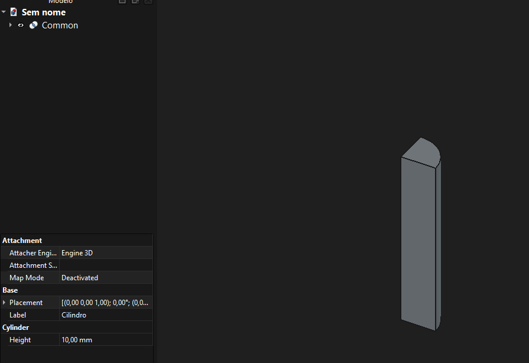
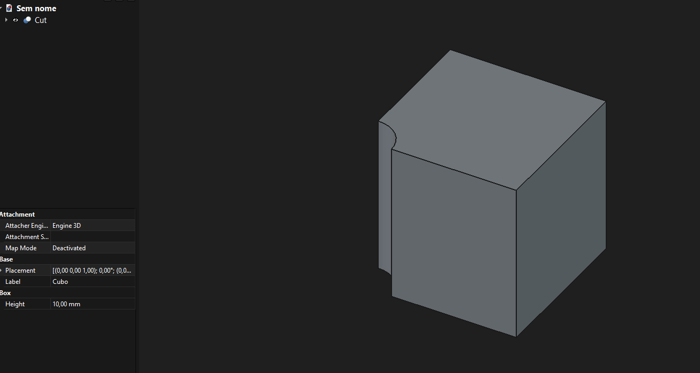
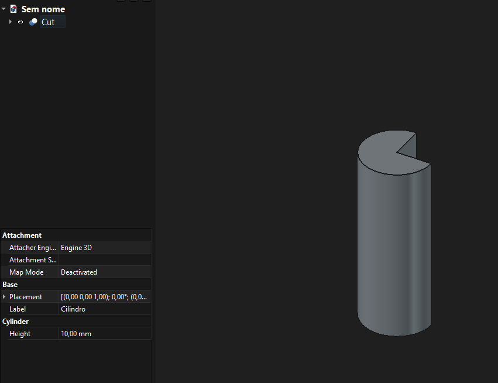

# Modelos de Representação Geométrica no FreeCAD
### Modelagem Geométrica

---

## O que é o FreeCAD?

- Software livre e paramétrico de modelagem 3D, com foco em **engenharia mecânica** e **design de produtos**
- Usado para: peças mecânicas, montagens, arquitetura (BIM), simulação estrutural, geração de desenhos técnicos e fabricação (CNC/3D printing)
- Arquitetura em **workbenches** (bancadas): cada uma especializada em um tipo de tarefa — e, por consequência, em um tipo de **representação geométrica**

Ideia central: não existe "um único modelo geométrico" no FreeCAD. A representação usada depende da <b>etapa do fluxo de trabalho</b> — projetar, simular, documentar ou fabricar.

---

## Por que o FreeCAD usa múltiplos modelos?

- Nenhuma representação é ideal para **todas** as tarefas
- Precisão exata (B-rep) ≠ Visualização rápida (malha) ≠ Simulação numérica (FEM) ≠ Fabricação (toolpath)
- O FreeCAD combina representações **derivadas** a partir de um "modelo mestre" central

---

## OCCT: o coração geométrico do FreeCAD

**Open CASCADE Technology (OCCT)** é a biblioteca C++ de modelagem geométrica que o FreeCAD usa como *kernel*.

- Fornece as estruturas de dados de **B-rep** (TopoDS_Shape, faces, arestas, vértices)
- Fornece os algoritmos: booleanos, fillets, chamfers, varreduras (sweep), extrusão, revolução
- Fornece a **tesselação** (BRepMesh) que gera a malha de visualização
- É a base sobre a qual **quase todas** as outras representações do FreeCAD são construídas ou derivadas

Praticamente toda representação geométrica no FreeCAD tem uma relação direta ou indireta com o OCCT: ou é gerada por ele (B-rep, malha de visualização), ou é convertida a partir dele (FEM, TechDraw, Path), ou alimenta ele como entrada (Sketcher).

---

## 1. B-rep (Boundary Representation)

**Kernel:** OpenCASCADE Technology (OCCT)

- Representação **central** de sólidos e superfícies
- Topologia exata: vértices, arestas e faces
- Geometria definida **analiticamente** (planos, cilindros, NURBS)

**Quando é usado:**
- Workbenches Part, Part Design, Surface
- Operações booleanas (união, corte, interseção)
- Fillets/chamfers paramétricos
- Histórico de features (parametric modeling)

---

## 1. B-rep — como funciona por dentro

- Estrutura hierárquica de topologia OCCT: **Compound → Solid → Shell → Face → Wire → Edge → Vertex**
- Cada `Face` referencia uma **superfície matemática** (plano, cilindro, esfera, NURBS) e é delimitada por `Wires` (contornos de arestas)
- Cada `Edge` referencia uma **curva matemática** subjacente (reta, círculo, spline), não pontos discretos
- Operações booleanas (union/cut/common) recalculam a topologia **exatamente**, recortando curvas e superfícies analiticamente — sem perda de precisão, ao contrário de um boolean em malha
- No Part Design, cada feature (Pad, Pocket, Fillet) gera um novo `TopoDS_Shape`, mantendo uma **árvore de histórico** paramétrico

---

## 2. Malha poligonal (Mesh)

**Workbench:** Mesh

- Conjunto de vértices, arestas e faces **poligonais** (aproximação)
- Sem histórico paramétrico

**Quando é usado:**
- Importação/exportação de STL, OBJ
- Dados vindos de scanners 3D
- Prototipagem rápida sem exigência de precisão exata
- Conversão Mesh → B-rep é possível, mas aproximada

---

## 2. Malha — como funciona por dentro

- Estrutura simples: lista de **vértices** (coordenadas) + lista de **facetas** (geralmente triângulos) que conectam esses vértices
- Não existe superfície matemática subjacente — a "curvatura" é apenas uma ilusão dada pela quantidade de triângulos
- Relação com OCCT: a **mesma malha de visualização** do B-rep (gerada via `BRepMesh_IncrementalMesh`) pode ser exportada como Mesh; e uma Mesh pode ser convertida para B-rep aproximado via *shape from mesh*, mas sem garantia de superfícies analíticas exatas
- Operações (suavização, redução de triângulos, reparo de furos) atuam diretamente sobre a malha, sem recorrer a nenhuma equação de superfície

---

## 2. Malha — Modelagem

É possível trabalhar com malhas (meshes) no FreeCAD, mas com uma ressalva importante: o FreeCAD é um software de modelagem sólida paramétrica (CAD). Isso significa que ele não foi feito para esculpir ou modelar malhas do zero como o Blender ou o Maya fazem.

---

## 3. Nuvem de pontos (Point Cloud)

**Workbench:** Points

- Conjunto bruto de pontos no espaço 3D, sem conectividade

**Quando é usado:**
- Dados brutos de scanner 3D / LiDAR
- Etapa **anterior** à reconstrução de superfícies ou malhas

---

## 3. Nuvem de pontos — como funciona por dentro

- É a representação **mais primitiva**: apenas coordenadas (x, y, z) — às vezes com cor/normal associada — sem nenhuma relação de vizinhança entre os pontos
- Não tem relação direta com o OCCT enquanto permanece nuvem de pontos; a ligação acontece **depois**, quando algoritmos de reconstrução de superfície (ex.: triangulação, ajuste de superfícies) geram uma Mesh ou, em casos mais elaborados, superfícies B-rep aproximadas
- Serve como **matéria-prima**: scanner → nuvem de pontos → (reconstrução) → malha ou B-rep → modelo utilizável

---

## 4. Geometria com restrições (Constraint-Based 2D)

**Motor:** planeGCS (solver de restrições geométricas)

- Não é B-rep nem malha — é um sistema de equações
- Resolve posições de linhas/arcos/círculos a partir de restrições (paralelismo, coincidência, dimensões)

**Quando é usado:**
- Workbench Sketcher
- Só vira B-rep quando o esboço é extrudado, revolucionado etc.

---

## 4. Restrições 2D — como funciona por dentro

- Cada elemento do esboço (linha, arco, círculo) é uma **variável simbólica**; cada restrição (coincidência, paralelismo, tangência, cota) vira uma **equação**
- O planeGCS resolve esse **sistema de equações não lineares** para encontrar a posição final de todos os elementos — é por isso que mudar uma cota "arrasta" o desenho todo
- Relação com OCCT: o resultado do solver (posições finais de pontos/curvas) é convertido em **curvas e arestas OCCT** (`Geom2d_Curve`/`TopoDS_Edge`) assim que o esboço precisa virar geometria 3D (extrusão, revolução) — o Sketcher é, portanto, uma "geometria de entrada" que alimenta o B-rep

---

## 5. Malha para Elementos Finitos (FEM)

**Ferramentas:** Gmsh / Netgen

- Malha numérica gerada a partir do B-rep, específica para análise
- Diferente da malha de visualização

**Quando é usado:**
- Workbench FEM
- Simulações estruturais, térmicas, etc.
- Solvers: CalculiX, Elmer

---

## 5. Malha FEM — como funciona por dentro

- Parte do **B-rep exato** (OCCT) do modelo e discretiza o volume/superfície em **elementos finitos**: tetraedros, hexaedros (3D) ou triângulos/quadriláteros (2D/casca)
- Diferente da tesselação de visualização: aqui o objetivo é criar elementos de **qualidade numérica** (razão de aspecto, densidade controlada, refinamento local perto de furos/cantos) para que os solvers convirjam corretamente
- Gmsh/Netgen leem a geometria B-rep exportada (via OCCT) e geram a malha; o resultado alimenta solvers como **CalculiX** (estrutural) ou **Elmer** (multifísica), que resolvem sistemas de equações diferenciais sobre essa malha

---

## 6. Trajetórias de ferramenta (Toolpaths)

**Workbench:** Path (CAM)

- Curvas/segmentos representando o percurso da fresa
- Representação própria em coordenadas (G-code)

**Quando é usado:**
- Geração de programas CNC
- Derivada da geometria B-rep do modelo final

---

## 6. Toolpaths — como funciona por dentro

- O workbench Path analisa as **faces e arestas B-rep** do modelo (ex.: face de topo, contorno de um bolso) para calcular por onde a ferramenta de corte deve passar
- O resultado é uma sequência ordenada de **comandos de movimento** (retas e arcos com coordenadas e parâmetros de corte: avanço, rotação, profundidade), armazenados como objetos `Path.Command`
- Essa sequência é depois traduzida por um **pós-processador** para **G-code**, o padrão que máquinas CNC interpretam
- Relação com OCCT: os cálculos geométricos de offset, interseção de contornos e detecção de colisão usam os mesmos algoritmos B-rep do OCCT sobre o modelo original

---

## 7. Projeções vetoriais 2D

**Workbench:** TechDraw

- Geometria 2D vetorial (vistas, cortes, dimensões)
- Projetada a partir do modelo 3D B-rep

**Quando é usado:**
- Geração de desenhos técnicos para documentação/fabricação

---

## 7. Projeções 2D — como funciona por dentro

- O TechDraw pega o `TopoDS_Shape` (B-rep) do modelo 3D e aplica uma **projeção geométrica** (ortográfica, isométrica, em corte) usando algoritmos do próprio OCCT (`HLRBRep` — Hidden Line Removal)
- O resultado são **arestas e curvas 2D exatas** (não pixels nem malha) representando contornos visíveis e ocultos, prontas para receber cotas, anotações e hachuras
- Por ser derivado diretamente do B-rep, qualquer alteração paramétrica no modelo 3D **atualiza automaticamente** as vistas técnicas — vantagem direta de manter tudo ancorado no mesmo kernel OCCT

---

## Tesselação: a ponte entre B-rep e malha

- Para exibir na tela ou exportar (STL), o B-rep é **tesselado** em triângulos
- Classe `BRepMesh_IncrementalMesh` (OCCT)
- Controlada por **deflexão linear** e **deflexão angular**
- Apenas para visualização/exportação — o modelo interno continua sendo B-rep exato

---

## Resumo — Modelo mestre e derivações

| Representação | Onde é usada | Papel | Relação com OCCT |
|---|---|---|---|
| B-rep | Part, Part Design, Surface | Modelo mestre (exato) | É o próprio kernel |
| Malha (Mesh) | Mesh, visualização, STL | Aproximação poligonal | Gerada por tesselação do B-rep |
| Nuvem de pontos | Points | Dado bruto de captura | Sem relação direta (entrada) |
| Restrições 2D | Sketcher | Base paramétrica 2D | Convertida em curvas/arestas OCCT |

---

## Resumo — Modelo mestre e derivações

| Representação | Onde é usada | Papel | Relação com OCCT |
|---|---|---|---|
| Malha FEM | FEM | Simulação numérica | Discretiza o B-rep via Gmsh/Netgen |
| Toolpath | Path (CAM) | Fabricação (CNC) | Calculada sobre faces/arestas B-rep |
| Projeção 2D | TechDraw | Documentação técnica | Projeção HLR do B-rep |

---

## Modelagem Paramétrica

Cubo e Cilindro

---

## Modelagem Paramétrica

Cubo ∪ Cilindro

---

## Modelagem Paramétrica

Cubo ∩ Cilindro

---

## Modelagem Paramétrica

Cubo - Cilindro

---

## Modelagem Paramétrica

Cilindro - Cubo

---

## Conclusão

- O **B-rep (via OCCT) é o núcleo** do FreeCAD: preciso, exato, paramétrico
- As demais representações são **derivadas** conforme a finalidade:
  - Visualizar → malha (tesselação)
  - Simular → malha FEM
  - Fabricar → toolpath
  - Documentar → projeção 2D
  - Capturar dados reais → nuvem de pontos / malha
- Essa arquitetura em camadas é o que permite ao FreeCAD ser, ao mesmo tempo, **preciso** (graças ao OCCT) e **versátil** (graças às representações derivadas)
